# 期权笔记

## 《期权，期货与其他衍生品》

### 期权分类

> 股票期权：多在交易所交易；100股为单位
>
> 货币期权：多在场外交易
>
> 股指期权：场内和场外；多为欧式期权
>
> 期货期权：交易所交易
>
> 交易所产品（ETP/ETV）期权

- Ps：一般到期日为到期月份的第三个星期五

## 《期权波动率与定价：高级交易策略与技巧》

### 	一、期权术语

#### 合约规范

+ 如果期权直接从银行或其他`交易商（dealer）`处购买，被交割的标的资产数量、执行价格、到期日都可以根据买方需要而订制。但如果期权是在交易所市场购买的，那么每份合约对应的标的资产交割数量、执行价格、到期日都已被预先设定。

- 由于期货合约有到期限制，所以期货期权的到期日通常与标的期货合约到期日相同。
- 许多交易所还上市`分期期权（serial options）`，这种期权的标的资产都是同一期货合约，但期权到期日不同。如果没有与期权到期日相同的期货合约时，期权的标的是期权到期后最近交割月份的期货合约。有的交易所上市`灵活期权（flex option）`，这类期权允许期权买卖双方对执行价格、到期日等进行协商。

#### 执行与指派

+ 交易者要执行期权必须先提交`履约通知（exercise notice）`，从交易商处买的期权要通知卖方，从交易所买的期权要通知`保证人（ guarantor ）` 。只有提交有效的交割通知后， 期权的卖方才被`指派（assigned）`。

  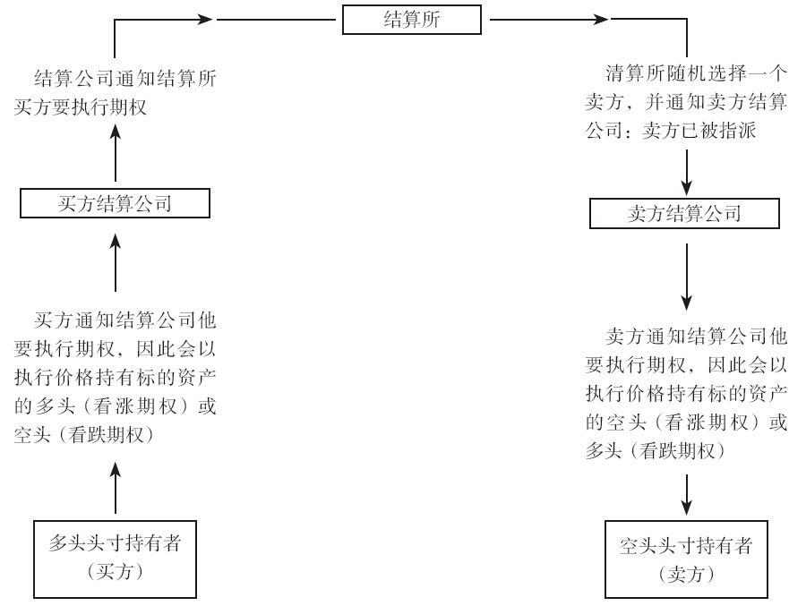

+ 在任何竞争性的市场中，期权的价格或`权利金（premium）`都是由供需决定的。

  > 支付的权利金可以分成两部分：**内在价值（intrinsic value）**与**时间价值（time value）**。
  >
  > 期权的内在价值是指对于期权持有者而言，期权的执行价格与执行时标的资产市场价格之间的差异。
  >
  > 市场上的期权价格通常要大于期权的内在价值。权利金中超出内在价值的部分是交易者为期权时间价值而支付的费用，也被称为期权的**时间溢价（time premium）**或**外在价值（extrinsic value）**。

+ 权利金总是等于内在价值加上时间价值，但二者均可能为零。如果期权没有内在价值，期权价格只包含时间价值；如果期权没有时间价值，期权价格只包含内在价值。后一种情况称为期权在`平价（parity）水平`上交易。

+ `实值期权（in-the-money）`：具有正内在价值的期权被称为实值期权（in-the-money），实值的数量就是内在价值。

  `虚值期权（out-of-the-money）`：没有内在价值的期权被称为虚值期权（out-of-the-money），虚值期权的权利金仅由时间价值组成。

  `平值期权（at-the-money）`：如果期权的执行价格与标的资产市场价格相同，则被称为平值期权（at-the-money）。[^1]

  > [^1]:平值期权具有最大的时间价值，通常交易异常活跃。

#### 市场诚信

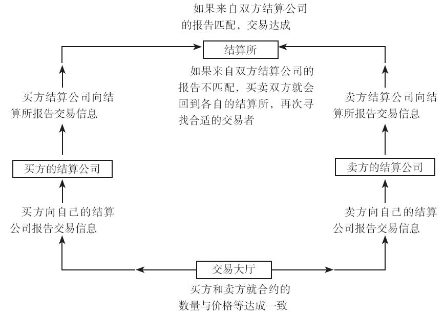

#### 保证金要求

+ 除现金外，能作为保证金的还包括政府债券，特定情况下商业票据（commercial securities）等也能用作保证金。
+ 由于与一份合约相关的风险可能会被其他合约部分抵消掉，所以一组期权或期权与标的资产组合的头寸可能会降低保证金要求。
+ Ps：在股票期权市场上，保证金被职业交易者称为抵扣（hair-cut）。

#### 结算流程

交易所交易的期权合约一般有两种结算方法：`股票型结算法（stock-type settlement）`和`期货型结算法（future-type settlement）`。

1. 股票型结算法：直至头寸平仓才能获得收益和损失的、需要即时全额支付的结算流程就是股票型结算
2. 期货型结算法：期货型结算并不需要买方向卖方的初始现金支付。更重要的是，所有收益和损失都立即实现

+ 在`追加保证金通知（margin call）`和`变动保证金通知（variation call）`之间存在重要区别。结算所发出的追加保证金通知是保证投资者未来在市场价格发生不利变动时能够履行财务义务。追加的保证金即使存放在结算所，但本身及其产生的利息仍属于交易者。结算所发出的变动保证金通知是为了实现当前的财务义务，交易者必须要交纳现金，并即时从交易者账户中扣减。
+ 目前美国所有以股票、期货、指数、外汇等为标的资产的交易所交易期权都是采取股票型结算的。许多美国之外的交易所将期权和标的资产的结算流程设定为一致，从而简化结算环节的问题。

### 二、基础策略

如果期权头寸持有到期时为平值期权或虚值期权，那么期权合约的价值就是零；如果期权合约到期时是实值期权，那么期权合约的价值就是内在价值（平价）。如果期权合约的交易价格小于其到期价值，购买期权合约是可获利的；如果期权合约的交易价格大于到期价值，卖出期权是可获利的。

#### 1、简单的买入、卖出策略

预期合约到期时的内在价值大于期权合约当前的市场价格，则买入，否则卖出

#### 2、风险/收益特征

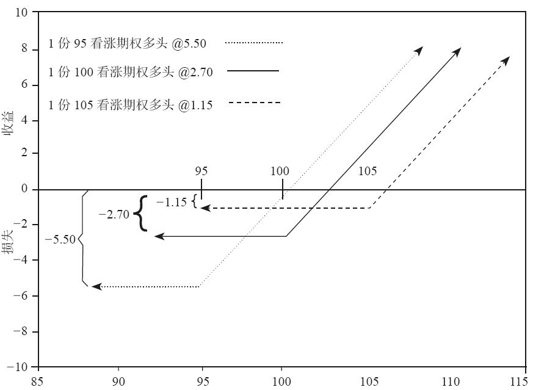

期权买方承担有限风险却获得无限潜在收益；期权卖方承担无限潜在风险却获得有限收益。但同时也要考虑风险情况出现的概率。

#### 3、组合策略

+ 同时买入看涨和看跌期权

  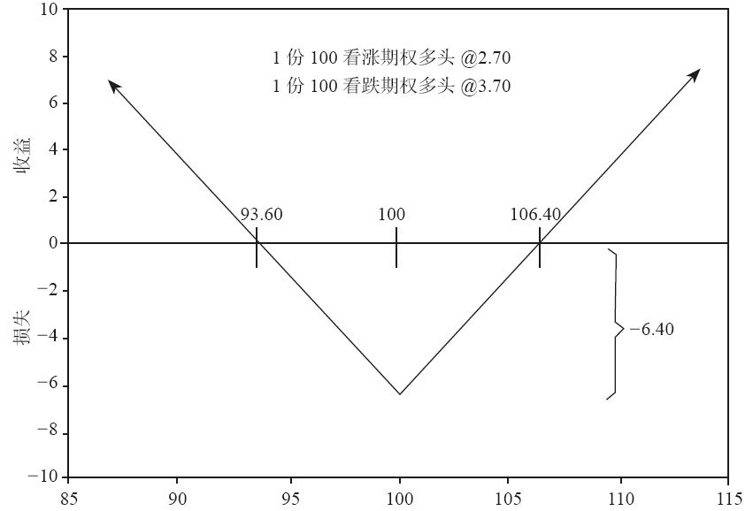

  在认为标的合约价格在不久的未来会发生剧烈波动，但又不明确价格波动方向时，使用这种组合头寸较合理。

+ 同时卖出看涨看跌期权

  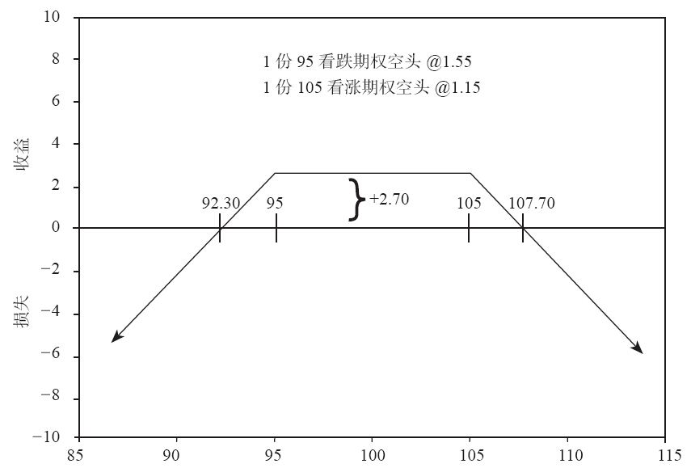

  认为标的合约价格不会波动过大

  可通过改变期权的行权价格来增加误差幅度

+ 买入或卖出同样数量的同类期权

  eg：买入90且卖出100

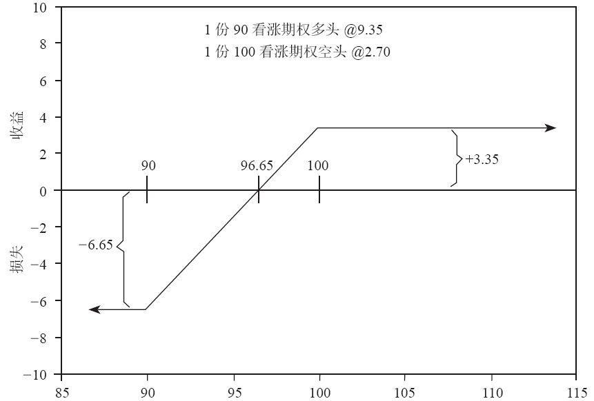

​		可以构造出有限风险、有限收益的头寸

#### 4、构建到期损益图

+ 根据每个合约的执行价格，确定每个合约执行价格的损益，然后连接。

+ 利用期权和标的合约的组合，还可以构建出模拟其他期权和标的合约的头寸。

  eg：以2.70的价格买入1份执行价格为100的看涨期权；以3.70的价格卖出1份执行价格为100的看跌期权
  无论标的合约到期价格如何，头寸将模拟1份标的合约现货多头头寸期权头寸和标的合约现货多头头寸唯一的区别在期权头寸期初会产生1点的资金流入。

  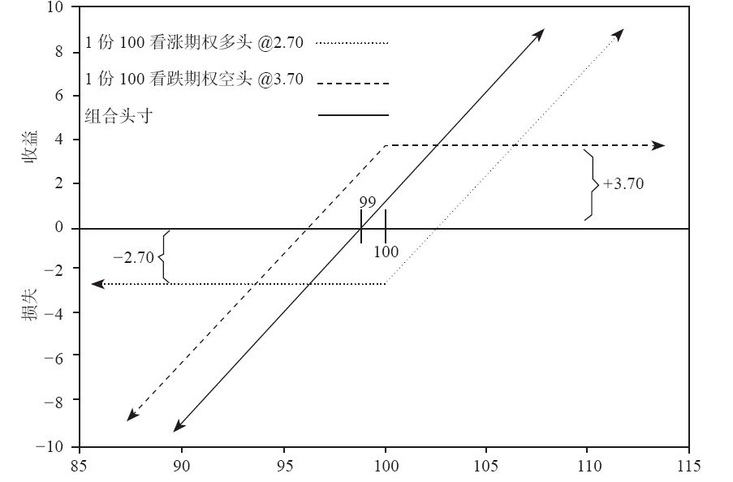

### 三、理论定价模型导论

+ 标的资产市场的交易者仅关心市场价格变动的方向；而期权交易者除了对价格变动方向敏感外，还要认真考虑市场价格变动的速度。如果市场价格变动不够快，有利的价格变动可能并不能抵消期权损失的时间价值。
+ 期权交易者在评价一项期权交易的潜在收益时，需要分析多种不同因素。至少要考虑以下几个因素：
  （1）标的合约价格；
  （2）期权执行价格；
  （3）剩余到期时间；
  （4）期望的标的资产价格变动方向；
  （5）期望的标的资产价格变动速度。

#### 1、期望收益

+ 95美分期望收益与1美元赌资间5美分的差异就是赌场的潜在收益，或称`胜率（edge）`。

#### 2、理论价值

+ **理论价值**是交易者愿意支付的长期来看不盈不亏的价格。
+ 金融投资中最常考虑的两个因素就是**期望收益**和**持有成本**。
+ 期权定价的目的是利用理论定价模型决定期权的理论价值。交易者就能据此确定市场上的期权是被高估还是被低估，并判断`理论边际（theoretical edge）`是否足以促使交易者进入市场进行交易。

#### 3、一种简单的方法

+ 将期望收益和理论价值的概念应用到期权定价中

+ 在美国，所有期权都是股票型结算方式，需要对期权交易进行全额支付。eg：如果执行价格为100美元的看涨期权到期时期望收益是6美元，还需要减去持有成本才能得到期权现在的价值。如果年化利率是12%（每月1%）、期权在2个月后到期，6美元的期望收益需要减去约2%的持有成本（也即12美分），期权的理论价值就是5.88美元。
  Ps：？为何此处使用期望收益乘2%来计算持有成本？这里相当于将两个月后的期望收益以2%的利率折现，就是现在的期权理论价值√
+ `简单方法：期权的理论价值=期权的期望收益*（1-持有成本收益率%）`
  ps：期望收益根据期权标的预计的价格和概率加权求得
+ 股票多头头寸要获得盈利，股价上涨幅度至少需要超过持有期间的持有成本，此时股票投资期望收益为正。
  如果股票投资盈亏平衡，那么期望收益一定等于股票投资的持有成本。
  有些股票还会发放股利。如果投资期间股票发放股利，就会改变投资的期望收益。
+ 在`无套利（arbitrage-free）市场`中，买入或卖出合约都不会获得盈利，包括期望收益在内的所有收入支出均相互抵消。如果我们假设的市场环境是无套利市场，我们还必须假设远期价格（forward price，即合约持有到期时的平均价格，不是指的远期合约的价格），等于当前价格加上所有收入与支出相互抵消后的期望收益。

##### 1）模型假设：无套利市场

##### 2）在开发定价模型时要经过以下步骤：
（1）列出到期时标的合约的可能价格；
（2）对每一价格结果赋予相应的概率；
（3）假设标的合约市场为无套利市场；
（4）利用步骤1、步骤2和步骤3中的价格及其概率，计算期权的期望收益；
（5）期权的期望收益中减去持有成本。

##### 3）期权理论定价模型(Black-Scholes Model)

为利用布莱克–斯科尔斯模型计算期权的理论价值，我们至少要知道期权及其标的合约的5个变量数据：
（1）期权的执行价格；
（2）剩余到期时间；
（3）标的合约当前市场价格；
（4）期权存续期间的无风险利率；
（5）标的合约价格的波动率。

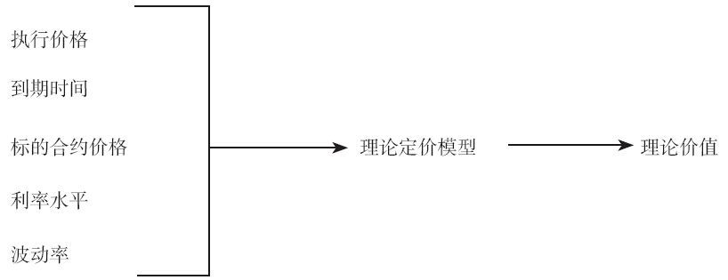

布莱克和斯科尔斯在其模型中引入`无风险对冲（riskless hedge）`的概念。对于每个期权头寸，理论上都对应一个相应的标的合约现货头寸。随着标的合约其市场价格的变动，期权头寸会产生与对应标的合约现货头寸一致的、同比例的收益和损失。为利用理论上定价错误的期权，需要建立与期权头寸对应的标的合约现货头寸进行套保。就是说，无论持有何种期权头寸，必须在标的合约市场上持有方向相反的标的合约现货头寸。为构建无风险对冲所需的标的合约数量比例被称为`套保比率（hedge ratio）`。

**核心逻辑：无风险对冲头寸，期权头寸可以被视为对相应标的合约现货头寸的替代**

一开始构建无风险对冲头寸，并根据市场变化调整相应的套保比率，将期末不同标的合约价格出现的概率的变化纳入考虑。

#### 4、B-S模型的六个变量

##### 1）执行价格

+ 合约上已经约定好

##### 2）到期时间

+ 输入模型之前要进行年化处理，eg：剩余91天的到期时间，我们需要输入0.25（91/365≈0.25）；剩余36天的到期时间，我们应输入0.10（36/365≈0.10）。

+ 剩余天数中需要将周末和节假日去掉。

##### 3）标的合约价格

+ 正确使用期权理论价值要求对期权头寸构建反向标的合约现货头寸进行对冲。因此，输入理论定价模型中的标的合约价格应该是能够构建反向标的合约现货头寸的价格。
  eg：如果我们想买入看涨期权或卖出看跌期权，两种情况都是看多市场价格，需要卖出标的合约进行对冲，此时应该使用市场买入报价，因为只有在此价格上我们才能卖出标的合约；相反地，如果我们想卖出看涨期权或买入看跌期权，两种都是看空市场价格，需要买入标的合约进行对冲，此时应该使用市场卖出报价，因为只有在此价格上我们才能买入标的合约。

##### 4）利率水平

+ 由于期权交易会在交易者银行账户上产生资金流入或资金流出，现金流产生的利息因素也会对期权定价产生影响。利息取决于期权剩余期限内的利率水平。
+ 利率因素在期权理论定价过程中产生两个方面的影响：一是影响标的合约的远期价格，如果标的合约是股票型结算模式的，利率水平提高就相当于远期价格提高，从而使看涨期权价值增大、看跌期权价值降低；二是利率水平会影响期权的持有成本，如果期权是股票型结算模式的，利率水平提高就相当于期权合约价值降低。
+ 模型输入的是一个利率值，但对于不同的标的产品，输入的不太一样，比如外汇期权输入的是两个利率值，外币利率和本币利率。
+ 利率产生两种作用的事实，意味着利率对于不同标的资产、不同结算方式的期权的重要性不同。
+ 常做的方法是使用`无风险利率（risk-free interest rate）`进行期权定价。60天期限的期权，使用60日短期国库券收益率；180天期限的期权，使用180日短期国库券收益率。

##### 5）股利

+ 只对股票期权定价产生影响。
+ 需知道股利发放数量和`除息日（ex-dividend data）`

##### 6）波动率

### 四、波动率

高波动率市场：价格变化较快；低波动率市场

#### 1、随机游走和正态分布

+ 随机游走，random walk：每一时刻物体都有50%的概率向左移动一单位或者50%的概率向右边移动一单位。
+ 正态分布（normal）/钟形分布（bell shaped distribution）
+ 可以假设标的合约价格为每天一定概率上涨或者下降一定概率的随机游走，则到期日时标的合约的价格分布服从正态分布，正态分布的峰值和尾部粗细取决于随机游走的每日变动幅度和距离到期时长。
+ 如果我们假设价格分布为正态分布曲线，那么标的合约的价值取决于分布曲线中峰值的位置，而期权的价值取决于曲线向左右两边展开的速度。

#### 2、均值和标准差

> ±1倍标准差大约覆盖了68.3%（约为2/3）的结果
> ±2倍标准差大约覆盖了95.4%（约为19/20）的结果
> ±3倍标准差大约覆盖了99.7%（约为369/370）的结果

#### 3、标的资产价格作为分布的均值

+ 当我们向模型中输入标的资产的当前市场价格时，我们实际上正在输入正态分布曲线的均值。B-S模型的一个重要假设是，在长期中标的资产的交易将达到盈亏平衡，不会赚钱或亏钱。基于这样的假设，模型里正态分布曲线的均值被假设为标的资产交易价格（不论是买入还是卖出）达到平衡时的价格。
+ 不同标的资产类型的均衡价格不同，等价于第三章远期价格（理论价值）的计算方法。（无套利市场中标的资产到期时的远期价格）

#### 4、波动率作为标准差

#### 5、对数正态分布

+ 当价格变化被假设为正态分布时，这些价格变动的连续计算将使到期价格的分布为`对数正态分布（lognormally distributed）`。分布是右偏的（右边样本占比多）。
+ 价格变化（收益率）服从正态分布→价格服从对数正态分布。
+ 布莱克–斯科尔斯模型是一个连续时间（continuous time）模型。它假设标的资产价格波动率在期权存续期内是不变化的，但波动率是连续计算的。这两个假设意味着**到期时标的资产的可能价格是对数正态分布的**。这也解释了为什么具有较高执行价格的期权比较低执行价格的期权具有更高的价值（这里，两个执行价格与标的资产价格差别相同）。

##### B-S模型中描述价格变动的大部分重要假设总结：
1. 标的资产价格变化是随机的，而且不能被人为操纵的，也不可能提前预测标的资产价格的变化方向。
2. 标的资产百分比价格变化是正态分布的。
3. 由于标的资产价格变动百分比被假设为连续计算的，因而到期时标的资产价格是对数正态分布的。
4. 对数正态分布的均值将等于标的合约的远期价格。

#### 6、每日和每周标准差

+ 波动率一个重要的特征是它与时间平方根呈正比。因此，我们可以用年化波动率除以以年表示的交易时间的平方根，这样就可以大致计算得到某段交易时间内的波动率。
+ 一年一般为256个交易日，52个交易周。

#### 7、关于利率产品[^2]

+ 利率产品与传统标的合约产品不太一样，100是欧洲美元合约的极限价格，与股票、商品合约把0作为价格极限一样。
+ 欧洲美元就像许多其他利率合约一样（美国国库券、短期英镑、欧洲马克、欧洲日元），指数是从100开始编制的。这意味着欧洲美元合约的利率等于100减去合约价值。
+ 在我们的理论定价模型中，93.50的执行价格实际上应为6.50（100－93.50）。这还需要我们把期权类型反转，即把看涨期权转化为看跌期权，把看跌期权转化为看涨期权。

[^2]:对于利率合约不懂

+ 持有债券等类似投资工具时，可以基于市场价格计算债券的当前收益率。如果我们使用一系列价格来计算一系列收益率，我们就可以计算出收益率的波动率（yield volatility），即基于收益率变化的波动率。然后就可以使用该值来计算基于债券的期权合约的理论价值（为了保持一致，我们需要从收益率的角度调整执行价格）。

#### 8、波动率的种类

不同说法的波动率代表的意思

1. 未来波动率：理论上，未来波动率就是我们所说的输入理论定价模型中的波动率。

2. 历史波动率：历史波动率的计算有各种方法，但大多数方法取决于两个参数的选取：波动率计算的历史阶段（10天，6个月、5年等）以及连续价格变动的时间间隔（日价格变化、周价格变化、月价格变化等）。

   历史和未来波动率有时被称为已实现（realized）的波动率。

3. 预测波动率：预测合约未来的波动率水平。

   > 前三者都是与标的合约联系在一起的

4. 隐含波动率（implied volatility)：基于期权合约而非标的合约的一种波动率，该波动率是我们将其输入理论定价模型后使理论价值正好等于实际市场价格的波动率水平。也可将其视为市场在为期权定价时，市场认为的标的合约的波动率。

   + 隐含波动率取决于所使用的理论定价模型。对于一些期权而言，不同的理论模型可以产生明显不同的隐含波动率
   + 隐含波动率的准确性也取决于其他模型输入变量的准确性，不仅包括期权价格，还包括其他输入变量。
   + 期权隐含波动率可以对同一标的合约的不同期权合约分别计算（单个隐含波动率），也可以指同一标的合约的所有期权合约的代表隐含波动率（单个隐含波动率的平均水平）。
   + 即使权利金这个词语确实指的是期权价格， 但交易者们通常还会把隐含波动率称为`权利金（premium）`或者`权利金水平（premium level）`。
   + 由于期权不寻常的特征，严肃的交易者**通常从隐含波动率的角度看待期权价
     格而不是从实际美元价格的角度来思考**。
   + 对于期权交易者而言，这通常意味着要将未来波动率与隐含波动率进行比较。如果与预期的未来波动率相比，隐含波动率较低，那么交易者会买入期权；如果隐含波动率较高，那么交易者就会选择卖出期权。

5. 季度波动率：

   + 对于特定的农作物商品，如玉米、大豆和小麦等，它们对于由季度天气因素所引起的波动率变化是非常敏感的。

### 五、利用期权的理论价值

+ 平值期权：

  + 平值期权是指执行价格（行权价）等于或非常接近标的资产的当前市场价格的期权合约。在平值期权中，期权的行权价格与标的资产的价格相当，没有额外的内在价值。平值期权的持有者在到期时无法获得盈利，因为执行期权的价格与标的资产的价格相同。
  + 平值期权通常被视为"无内在价值"的期权，因为如果在当前时点执行该期权，其结果将是无盈利或无损失。然而，平值期权仍然具有时间价值，因为期权的价格可能受到时间衰减和市场波动性等因素的影响。
  + 投资者在选择平值期权时，主要依据是期望标的资产在未来的价格变动。如果投资者预期标的资产价格将有显著波动，那么平值期权可能会更具吸引力，因为随着标的资产价格的变动，平值期权的时间价值可能会增加。

+ **买入或卖出理论上定价错误的期权，需要在标的合约现货上建立方向相反的套保头寸**。如果正确建立套保头寸的话，标的合约价格的微小变动，期权头寸价值的增加（减少）都能正好抵消标的合约现货反向头寸的价值减少（增加）。对于标的合约的价格变动，这一套保组合是`无偏的（unbiased）`，或称“中性”的。

+ 在当前市场条件下，确定建立中性套保头寸的标的合约数量是期权理论定价模型的副产品，被称为`套保比率（hedge ratio）`，或更常见地被称为`Delta值`。

  + Delta值的一些重要特性：
    （1）看涨期权的Delta值介于0~1.00之间；
    （2）随市场条件变化，期权的Delta值也将发生相应变化；
    （3）标的合约的Delta值总是1.00。
  + Ps:我们还要遵守的惯例是，期权交易者在讨论Delta值时通常忽略小数点。也就是说，看涨期权的Delta值通常被表达为介于0~100的某个数字，标的合约的Delta值总被称为100。
  + 将两个Delta值头寸数字（即+5700和-5700）相加，总的Delta值为0，我们称这样的头寸为`“Delta值中性”（Delta neutral）`。如果总头寸Delta值为正，表明价格上涨有利于头寸（upward bias）；如果总头寸Delta值为负，表明价格下跌有利于头寸（downward bias）。

+ 为了获得长期内的有利概率，我们可以通过定期评估、调整头寸，以便使每个阶段内的调整都是新的投资组合。定期评估期权的Delta值，根据新的Delta值建立新的头寸，依旧保持Delta值中性。

+ **利用期权理论价值获益所需的程序：**
  （1）买入（卖出）低估（高估）的期权合约；
  （2）利用标的合约建立起Delta值中性头寸；
  （3）定期调整套保头寸以保持Delta值中性。

+ ``````python
  # thinking：套保头寸的核心逻辑是只赚取根据理论模型定价得到的期权价值和期权价格之间的差值，不需要期权对应的标的资产价格变化带来的收益，所以方向相反的现货合约头寸对冲掉这部分风险。而持有过程中反复调整头寸，交易者以同样胜率进行多次投资，调整过程有效平滑了投资的收益和损失，是从概率学的角度，调整本身并不改变预期收益，只是降低短期内出现坏运气的概率。
  
  # ！期权理论定价模型都是基于概率法则
  ``````

+ 输入变量都是正确的情况下，理论模型能非常有效地预测到套保头寸的实际收益。但未来波动率变量不能观测到，只能估计。
  且假设了市场是`无摩擦（frictionless）`的：

  （1）交易者能够无限制地自由买卖标的合约；
  （2）所有交易者能在同一个利率水平上借入、借出资金；
  （3）交易成本为0；
  （4）不用考虑税收因素。

+ 套保头寸的假设真实情况下部分不满足：
  + 一些期货合约市场中，日内价格变动是有限制的
  + 个人投资者也不能像大型金融机构那样，在同样的利率水平上借入和借出资金
  + 交易成本因素，中介费
  + 税收通常会对多样化投资组合的估值产生较大影响

+ 事实上，在禁止卖空的市场中，相对于看涨期权，看跌期权的交易价格明显偏高。

+ 根据理论定价模型，到期时`动态套保（dynamic hedge）`产生的总现金流量与期权的价值恰好相同。
+ 这种`期权复制策略（option replication）`（即利用标的合约进行连续套保所产生的现金流）是很多利用期权特征但又不实际交易期权合约的交易策略的基础。

### 六、期权价值与变化的市场条件[^3]

[^3]:几个希腊数字的含义不太熟练，实际意义不了解

+ 市场条件变化对期权价值的一般影响：

  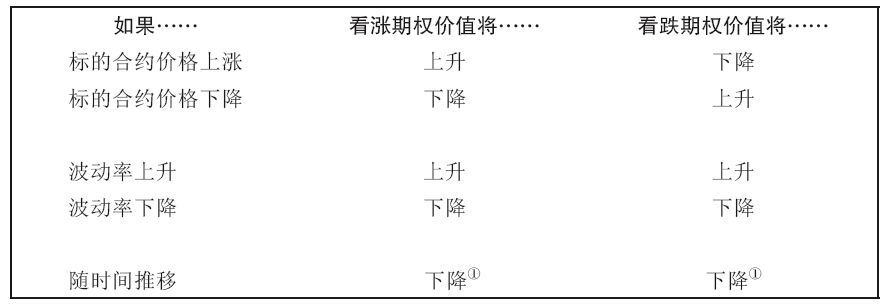

+ 利率水平升高将使股票看涨期权价值上升，利率水平降低将使股票看涨期权价值下降。利率水平升高将使股票看跌期权价值下降，利率水平降低将使股票看跌期权价值上升。

  + 当所考察的期权为外汇期权时，情况将更为复杂。因为交易者此时必须应对两种利率——本国利率与外国利率。

  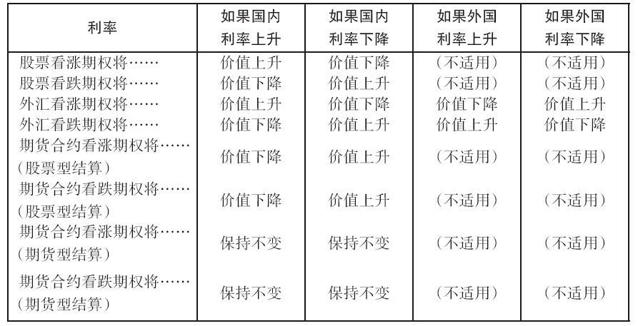

+ 股票期权存续期间的预期股利也会对期权价值产生影响。股利增加会使股票看涨期权（看跌期权）价值下降（上升）；股利减少会使股票看涨期权（看跌期权）价值上升（下降）。

#### 1、Delta（$\Delta$）

Delta在期权中有多种解释含义

1. 变化率

   Delta就是度量期权价值如何随标的合约价格变化的数值。（下图斜率为delta）

   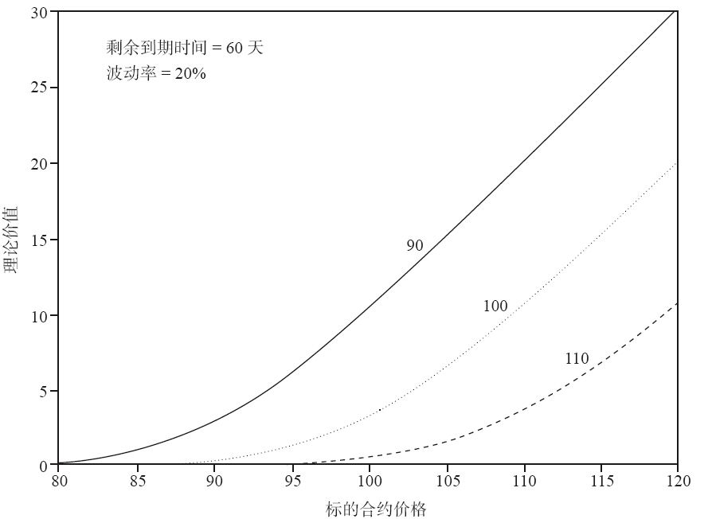

   + 理论上来说，期权价值增加或降低的速度不可能比标的资产的价格增减速度更快，因此，看涨期权Delta值存在上限，为100（同样，我们按常规的处理方式，在书写Delta值时不加小数点，数值为1.00的Delta写成100。这有时被称为百分比格式）
   + 平值看涨期权的Delta值接近于50，它们的价值涨跌幅度刚好是标的资产变化率的一半左右
   + <!--大多数看涨期权的Delta值在0~100-->
   + 随时间流逝或当降低波动率假设时，看涨期权Delta值将远离50，看跌期权Delta值将远离-50；当提高波动率假设时，看涨期权Delta值将趋近于50，而看跌期权Delta值将趋近于-50。

2. 套保比率

   Delta值：根据期权合约建立中性套保头寸所需标的合约的适当比率。

   + 不管是由期权与标的合约构成的套保头寸、还是由期权与期权构成的套保头寸，只要头寸的Delta值总和为零，那么该头寸即是Delta中性的。

3. 理论或等效的标的合约头寸

4. 忽略Delta值的符号（看涨期权Delta值为正号，看跌期权Delta值为负号），则Delta值近似等于期权到期时为实值期权的概率

#### 2、Gamma（$\Gamma$）

Gamma有时被称为期权的`曲率（curvature）`）是标的合约价格变化时期权Delta值的变化率。Gamma通常被描述为：当标的合约价格每变化1个点时Delta值增加或减少的数量。看涨期权Delta值与标的合约价格，斜率为gamma

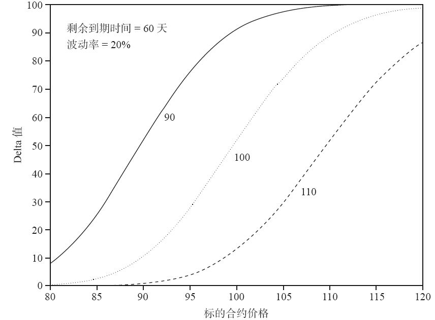

+ 看涨期权与看跌期权的Gamma值都是正数
+ Gamma是一种测度期权改变其方向性特征的速度的方法，与实际标的头寸的变化较为接近。基于方向性风险的重要性，Gamma值成为一种重要的风险度量手段。
+ 高Gamma值都意味着高风险水平，低Gamma值都意味着低风险水平。每一位期权交易者都明白，他们需要密切关注的不仅是当前的方向性风险（即Delta值），还要关注当标的市场价格变化时方向性风险如何变化（即Gamma值）。
+ Gamma还能帮助交易者快速估测Delta变化以维持Delta中性头寸。
+ **市场条件变化对Gamma值的影响：**
  1. 平值期权的Gamma值最大，并随着期权逐渐变为实值期权或虚值期权而逐渐减小。
  2. 随着到期时间的临近或波动率假设的减小，平值期权的Gamma值将大幅增加。
  3. 交易者的Gamma头寸初始时可能很小，但随时间推移或波动率变化，Gamma值可能会变得越来越大。
+ 当我们假设剩余到期时间越长或波动率越高时，所有期权都将变得更接近于平值期权，也即看涨期权Delta值接近于50、看跌期权Delta值接近于-50。与之相反，当假设剩余到期时间越短或波动率越低时，所有期权的Delta值将离50越来越远（对于看跌期权而言是-50）。实值期权将因此变得更加实值，虚值期权将变得更加虚值。Delta值接近于50的平值期权将不受时间变化与波动率变化的影响，其Delta值特性保持不变。

**Delta中性头寸依赖于对当前及未来市场条件的估测，而这些估测的正确性无法得到保证。**

#### 3、Theta（$\Theta$）

+ 无论看涨期权或看跌期权，所有期权的价值都会因到期时间的临近而下降。

**==Theta（θ），或称时间衰减因子（time decay factor），是指随时间流逝期权价值的下降速度。==**

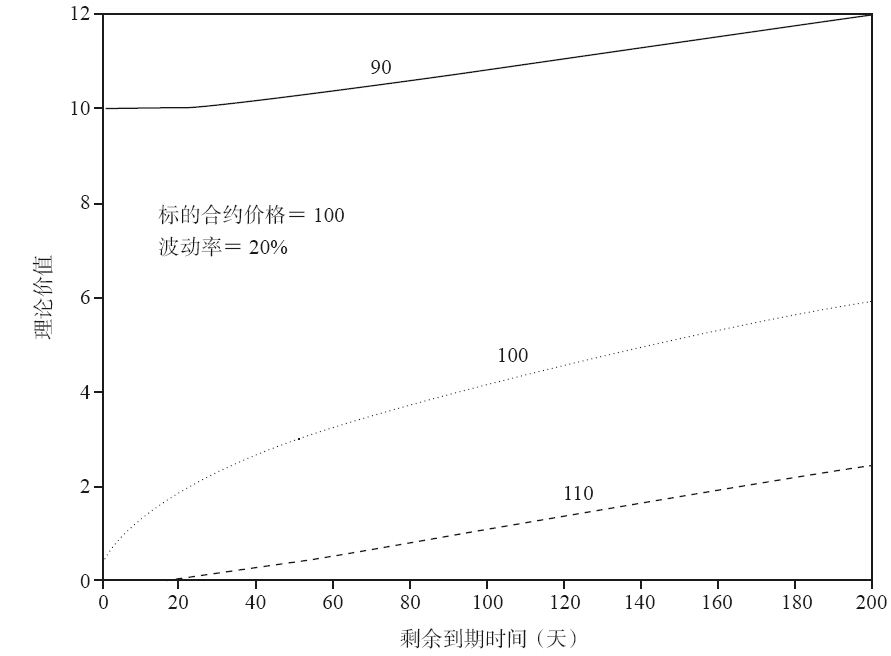

+ 期权多头头寸的Theta值总为负数，期权空头头寸的Theta值总为正数（头寸，不是价值）。与Gamma值符号恰好相反，期权多头头寸的Gamma值为正，期权空头头寸的Gamma值为负。
+ 高正值Gamma通常与高负值Theta同时出现，而高负值Gamma与高正值Theta同时出现。
+ 每个期权头寸都是市场价格变化与时间衰减相权衡的结果。如果标的资产价格变化有利于交易者（即Gamma为正），那么时间流逝将不利于交易者（即Theta为负）；反之亦然。
+ 允许提前行权的美式期权价值不可能低于平价，因而美式期权的Theta值不可能为正数。但欧式期权会存在theta值为正数的可能。

#### 4、Vega或Kappa （$\Kappa$）

==期权Vega值通常是指波动率每变动1个百分点时期权理论价值的变化。==

fig. 看涨期权或看跌期权的Vega值与剩余到期时间：

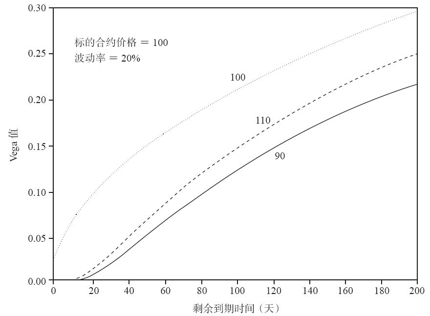

+ 由于所有期权都会因波动率增加而价值上升，所以看涨期权与看跌期权的Vega值均为正数。
+ 当期权类型与剩余到期时间相同时，平值期权的Vega值总是比实值期权或虚值期权大，平值期权总是对波动率的变化最敏感。
+ 虚值期权价值变动百分比总是对波动率变化最为敏感。
  <!--由于很多期权策略包含买入、卖出数量不等的期权合约，因而当我们考虑交易策略时，该特性将非常重要-->
+ 在其他合约规格相同的条件下，长期期权对于波动率的变化总是会比短期期权更为敏感。
+ 无论波动率如何变化，平值期权的Vega值相对恒定。

#### 5、Rho（$\Rho$）

==期权理论价值对利率变动的敏感性被表达为Rho（$\Rho$）。==

+ Rho的特性取决于标的资产类型与期权合约的结算方式。

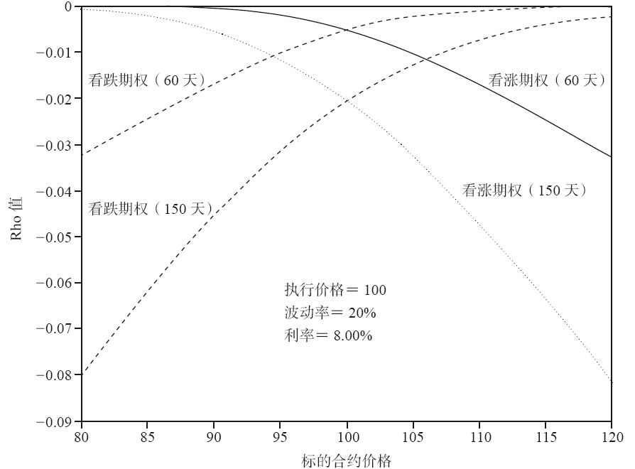

+ 外汇期权要求货币交割，因此它同时受到本国与外国利率的影响。外汇期权因而具有两种利率敏感度指标——$Rho_1$（本国利率敏感度）与$Rho_2$（外国利率敏感度）。后者有时以希腊字母phi（$\Phi$）来表示。
+ 如果标的合约与期权合约都采用期货型结算方式，则Rho值一定为零，因为无论标的合约的交易还是期权合约的交易都不会产生现金流。当期货期权采用股票型结算方式时，看涨期权与看跌期权的Rho值均为负数。由于利率上升增加了期权的持有成本，利率上升将使此类期权的价值下降。对于股票期权而言，看涨期权的Rho值为正数（利率上升会使看涨期权比买入股票更有利），看跌期权的Rho值为负数（利率上升将使卖出股票比看跌期权更有利）。
+ 距到期时间越长，Rho值越大。

#### 6、总结

+ 知道期权头寸的累计Delta、Gamma、Theta、Vega等值可帮助交易者事先判断出头寸如何对市场条件的变化做出反应。

+ 头寸的总体敏感度指标可以通过对单个期权的敏感度指标加总而得到。比如头寸组合的Gamma和Theta值，可以通过组合中单个期权头寸的Gamma和Theta值相加得到。

+ Delta、Gamma、Theta、Vega头寸，不同头寸及相应的正负符号归纳：

  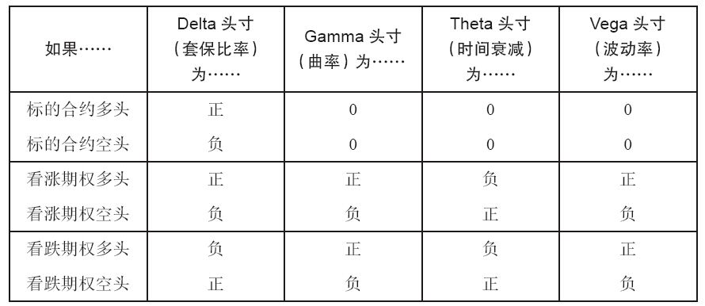

+ 市场条件变动所产生的正面影响和负面影响：

  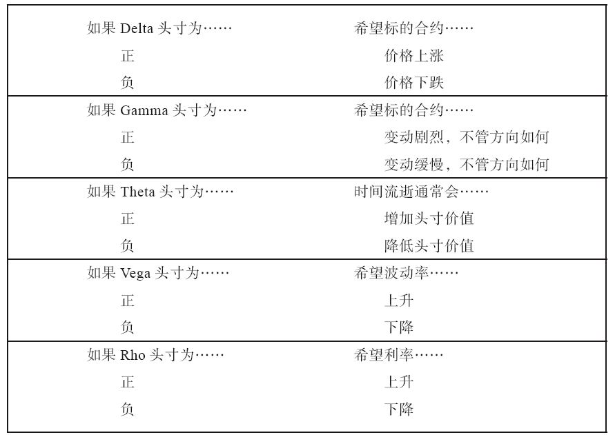

+ 上半部分是基于虚拟期货合约的期权的理论估值表。表格下面是多个可能的期权头寸及其累计的理论边际、Delta、Gamma、Theta、Vega的计算结果：

  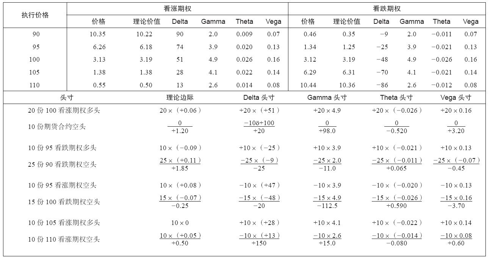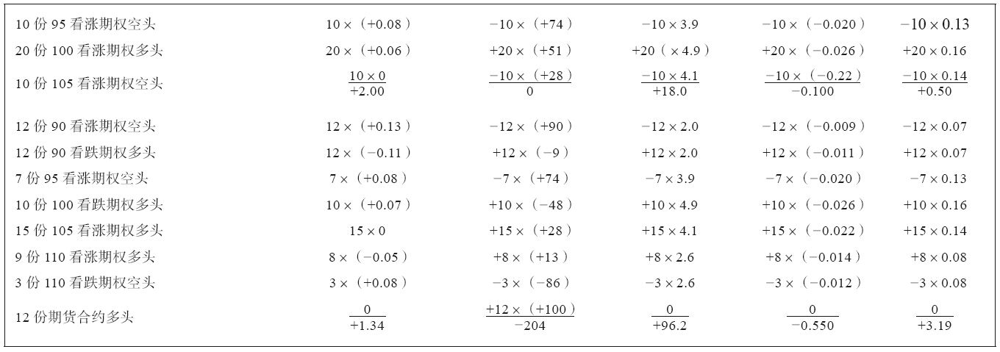

**另一种期权敏感度指标，`期权弹性（elasticity）`，omega（$\Omega$）或者lambda（$\lambda$）：指在特定标的合约价格变化百分比下期权价值的相对变化百分比。**

+ 期权弹性有时也被称为期权的杠杆价值（leverage value）。期权弹性越大，期权的杠杆越高。

### 七、价差导论

+ 交易池交易员常用的一种交易策略是转手倒卖（scalping）。倒卖者倾向于尽可能频繁地以买入报价买入再以卖出报价卖出，而不考虑合约的理论价值。
+ 大多数成功的期权交易者都会进行`价差（spreading）交易`。

#### 1、价差

价差指的是一种同时持有不同金融工具相反头寸的交易策略。

+ 价差交易者假设在不同金融工具之间存在着可识别的价格关系，且金融工具间的价格关系应该会保持相对稳定。当这一关系出现暂时偏差时，价差交易者将持有价格被低估金融工具的多头头寸，持有价格被高估金融工具的空头头寸。当资产间价格回复到预期关系时，交易者将获利。
+ 期货交易者最常使用的价差是持有同一标的的不同交割月份的相反头寸。这种`市场内价（intra-market spread）`的价值取决于很多因素，其中最重要的因素通常是从一个交割月份到另一个交割月份之间持有实物商品的成本。

+ 理论上，融资成本、存储、保管及为某种传统货物（贵金属、农产品、家畜、能源产品等）保险的相关成本一定是正数，所以较远交割月份的期货合约价格应该比临近交割月份的合约价格更高，这种现象被称为`远期升水（contango）`关系。这些成本的上升都将使期货合约价值增加。
+ 当市场中临近交割月份期货合约价格比远月交割月份的期货合约价格高时，这种现象被称为处在`远期贴水（backwardation）`关系。原材料的供需因素常使传统商品市场进入远期贴水状态。
+ 价差不仅可以建立在基于同一标的的不同交割月份的合约间。我们也能通过价格具有相关关系的不同资产的假设价格关系建立价差。

<!--美国中期、长期国债报价以美元与1/32美元进行报价-->

+ 价差关系不仅限于两种资产之间，有时3种或更多的不同资产间也可能构成一组价差关系。==期权交易者可以利用两份期权之间的隐含波动率之差（下文称“波动率价差”，**volatility spread**）表示期权间的价差关系==
+ 价差也可以是动态的，这要求交易者在价差存续期间采取行动，以便于从定价偏差中获利。**利用期权与标的合约间的价差关系，交易者在期权存续期间不断调整头寸。**到期时，最终所得利润约等于期权初始定价错误的数量。

+ 大多数期权理论定价模型利用概率法则计算期权价值。然而，即使正确估测出概率数据（即波动率），概率理论也只在大样本条件下（对期权而言，是指在很长的时间阶段内）成立。

+ 价差策略不仅能够使交易者按概率法则长期持有期权头寸，也能够保护交易者免受定价模型错误输入变量的影响。

#### 2、作为风险管理工具的价差

+ 价差策略能够确保潜在收益，同时又降低了短期风险。

### 八、波动率价差

·每个价差都是Delta中性的；
·每个价差对标的资产的价格变动都是敏感的；
·每个价差对隐含波动率的变动也是敏感的；
·每个价差对时间的推移也是敏感的。
具有上述性质的价差属于一般意义上的波动率价差范围

#### 1、反套利价差

也称为`比例反套利价差（ratio backspread）`或`比例价差多头（long ratio spread）`

==一个反套利价差（backspread）是Delta中性的，由期权多头（买入）和期权空头（卖出）组成，其中多头期权数量多于空头期权数量，且所有期权到期日相同。==需要买入Delta值较小的期权、卖出Delta值较大的期权。

+ 看涨期权反套利价差由较高执行价格的看涨期权多头和较低执行价格的看涨期权空头组成；看跌期权反套利价差由较低执行价格的看跌期权多头和较高执行价格的看跌期权空头组成。

+ 典型的看涨期权反套利价差：

  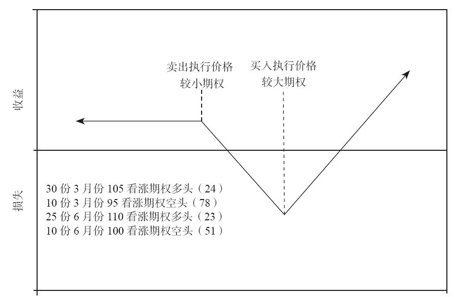

  > 执行价格较小期权左边，赚卖出和买入期权的价格差，执行价格较大期权右边，赚两期权份数不同的多出来的看涨期权多头带来的收益。

+ 反套利价差最重要的考虑是价格会发生变动，如果没有价格变动发生，那么反套利价差就失去意义。

+ 交易者对于反套利价差的选择反映出他对于市场价格变动方向的看法。如果他预测市场价格未来有可能会大涨，他将选择看涨期权反套利价差；如果他认为市场价格未来有可能会大跌，他将会选择看跌期权反套利价差；在市场价格相对平稳时，交易者会避免构建反套利价差，因为标的合约价格不会有太大的变化。

#### 2、比例垂直价差

也被称为`比例价差（ratio spread）`，`比例价差空头（short ratio spread）`，`垂直价差（vertical spread）`或`正面价差（front spread）`。

==交易者持有与反套利价差完全相反的头寸也是Delta中性的，但是空头期权合约数量要大于多头期权合约数量（所有期权的到期日均相同）。==

+ 希望标的价格不要发生太大变动

#### 3、跨式期权

==跨式期权（straddle）包含1份看涨期权多头和1份看跌期权多头，或者1份看涨期权空头和1份看跌期权空头，且所有期权合约的执行价格和到期时间均同。==

+ 如果是买入看涨期权和看跌期权，那么称为买入跨式期权；如果是卖出看涨期权和看跌期权，那么称为卖出跨式期权。
+ 任何的市场合约多头（买入看涨期权或卖出看跌期权）数量与市场合约空头（卖出看涨期权或买入看跌期权）数量不相等的头寸都被称为比例价差（ratio spread）。最常见的比例价差是反套利价差和比例垂直价差。
